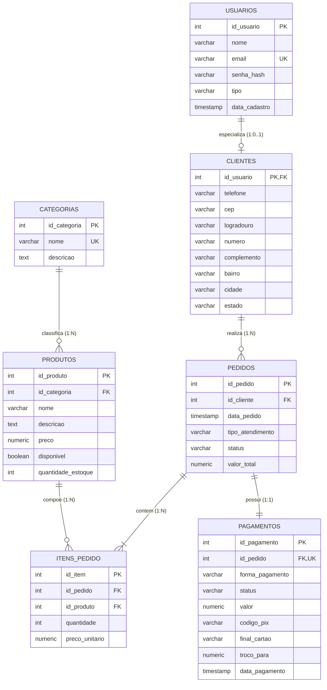

## Modelo Entidade-Relacionamento (MER) — Caffè D'Autore

```mermaid
erDiagram
    USUARIOS {
        int id_usuario PK
        varchar nome
        varchar email UK
        varchar senha_hash
        varchar tipo
        timestamp data_cadastro
    }

    CLIENTES {
        int id_usuario PK, FK
        varchar telefone
        varchar cep
        varchar logradouro
        varchar numero
        varchar complemento
        varchar bairro
        varchar cidade
        varchar estado
    }

    CATEGORIAS {
        int id_categoria PK
        varchar nome UK
        text descricao
    }

    PRODUTOS {
        int id_produto PK
        int id_categoria FK
        varchar nome
        text descricao
        numeric preco
        boolean disponivel
        int quantidade_estoque
    }

    PEDIDOS {
        int id_pedido PK
        int id_cliente FK
        timestamp data_pedido
        varchar tipo_atendimento
        varchar status
        numeric valor_total
    }

    ITENS_PEDIDO {
        int id_item PK
        int id_pedido FK
        int id_produto FK
        int quantidade
        numeric preco_unitario
    }

    PAGAMENTOS {
        int id_pagamento PK
        int id_pedido FK, UK
        varchar forma_pagamento
        varchar status
        numeric valor
        varchar codigo_pix
        varchar final_cartao
        numeric troco_para
        timestamp data_pagamento
    }


    USUARIOS ||--o| CLIENTES : "especializa (1:0..1)"
    CLIENTES ||--o{ PEDIDOS : "realiza (1:N)"
    CATEGORIAS ||--o{ PRODUTOS : "classifica (1:N)"
    PEDIDOS ||--|{ ITENS_PEDIDO : "contem (1:N)"
    PRODUTOS ||--o{ ITENS_PEDIDO : "compoe (1:N)"
    PEDIDOS ||--|| PAGAMENTOS : "possui (1:1)"
```
